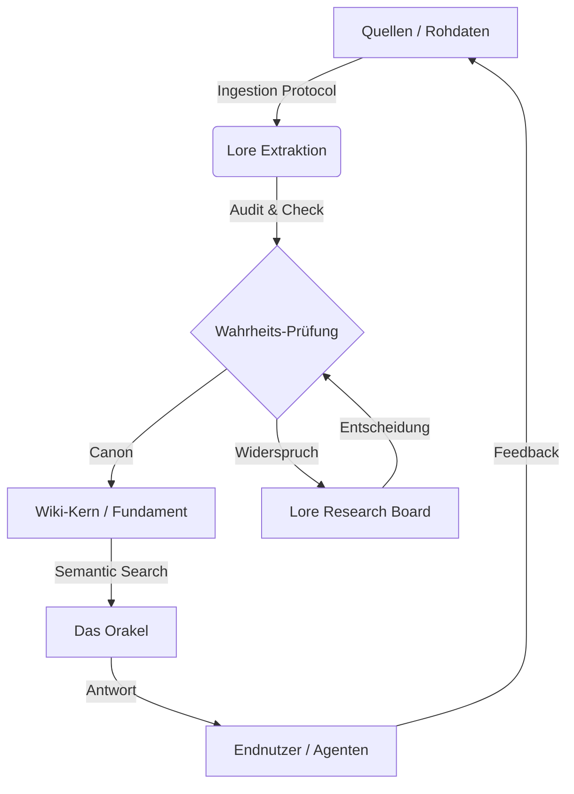

# <p align="center">⚔️ Siebenwind Lore Engine 2.0</p>

<p align="center">
  
</p>

<p align="center">
  <a href="https://github.com/Siebenwind/7w_wiki">
    
  </a>
  <a href="https://Siebenwind.github.io/7w_wiki/">
    
  </a>
  <a href="https://github.com/Siebenwind/7w_wiki/blob/main/CHANGELOG.md">
    
  </a>
</p>

---

## 🏛️ Der Codex (Vision)
Das zentrale Intelligenz-Framework für die Welt von Siebenwind. Dieses Projekt ist nicht nur ein Wiki, sondern eine **standardisierte Lore-Engine**, die 20 Jahre Rollenspielgeschichte durch eine KI-gestützte Architektur vereint, saniert und für die Zukunft bewahrt.

> [!TIP]
> **[Hier geht es zum interaktiven Siebenwind Wiki (Live Preview)](https://Siebenwind.github.io/7w_wiki/)**
> *MkDocs Material v9 | Durchsuchbar | Mobiloptimiert | Dunkelmodus*

---

## 🧠 Die Architektur (Wisdom Loop)

Das System funktioniert als geschlossener, kybernetischer Kreislauf (Trias Politica).



> 📖 **Deep Dive:** [Architektur & Philosophie (Trias Politica)](docs/architecture.md)

---

## 📜 Die Protokolle (Handbücher)

Hier finden Agenten und Entwickler die Gesetzestexte der Engine:

| Protokoll | Beschreibung | Status |
| :--- | :--- | :--- |
| **[Ingestion Protocol v3.0](docs/ingestion_protocol.md)** | Standard für die Aufnahme neuer Daten (Boten, Forum). | ✅ Aktiv |
| **[Wiki Style Guide](docs/wiki_style_guide.md)** | Formatierung, Tone of Voice und Tagging-Regeln. | ✅ Aktiv |
| **[RAG / Orakel Setup](docs/setup_rag.md)** | Technische Anleitung für die semantische Suche. | ✅ Aktiv |
| **[Contributing Guide](CONTRIBUTING.md)** | Wie man mitarbeitet (Issues, Pull Requests). | ✅ Aktiv |

---

## 🎨 Art Direction: "Codex Atlanticus" (Vorschlag)

*Wir streben eine visuelle Identität an, die technische Präzision mit der Ästhetik der Renaissance verbindet.*

**Stil-Vorgabe:** Leonardo da Vinci (Rötel, Silberstift, Sepia-Tinte).
**Konzept:** Die "Lore Engine" wird nicht als Computerprogramm dargestellt, sondern als komplexe mechanische Apparatur aus Holz, Messing und Pergament.

**Vorgeschlagene Banner-Motive:**
1.  **"Der Webstuhl der Wahrheit"**: Eine hölzerne Maschine, die Fäden (Storylines) zu einem Teppich (Wiki) verwebt. Rötel-Zeichnung.
2.  **"Das Orakel-Getriebe"**: Ein Querschnitt durch einen mechanischen Kopf, in dem Zahnräder (Vektoren) ineinandergreifen. Silberstift auf vergilbtem Papier.
3.  **"Die Anatomie des Archivs"**: Eine vitruvianische Darstellung der Siebenwind-Welt, vermessen mit Zirkel und Lineal.

*(Diese Assets sind noch zu erstellen)*

---

## 🚀 Unified CLI: `7w_wiki.py`

Wir haben alle Intelligenz-Tools in einer zentralen Schnittstelle gebündelt.

```bash
# Lore-Suche (Orakel)
./7w_wiki.py search "Wer gründete den Löwenorden?"

# Konsistenz-Audit
./7w_wiki.py audit

# Status-Check (Advisor)
./7w_wiki.py advisor
```

---

## 📜 Lizenz & Nutzung
Dieses Projekt nutzt ein **Dual-License Modell**:
- **Code:** [MIT License](LICENSE) (Freie Nutzung der Software).
- **Lore & Assets:** [CC BY-NC-SA 4.0](LICENSE) (Namensnennung, Nicht-Kommerziell, Weitergabe unter gleichen Bedingungen).

Bitte beachte `CONTRIBUTING.md` und `CODE_OF_CONDUCT.md` für die Mitarbeit.

*© 2026 LeCorbeau | Engineered for Intelligence*
