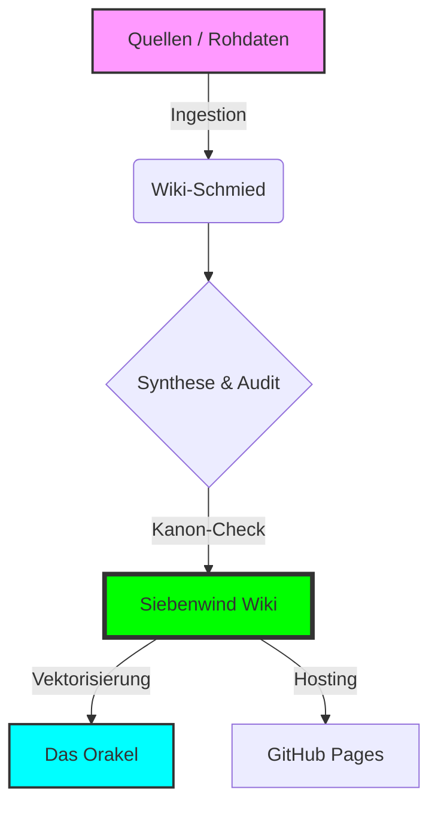

# ⚔️ Siebenwind Wiki 2.0


Das zentrale Wissensarchiv der Siebenwind-Welt. Konsolidierung von zwei Jahrzehnten Rollenspiel-Lore in eine hochstrukturierte, semantisch durchsuchbare Markdown-Datenbank.

---

## 🗺️ Schnellnavigation

| Dokument | Zweck |
| :--- | :--- |
| 📜 **[Changelog](CHANGELOG.md)** | **Alle technischen & inhaltlichen Updates auf einen Blick.** |
| ✅ **[Master Task List](MASTER_TASK_LIST.md)** | **Aktueller Projektstatus und offene Aufgaben.** |
| 📊 **[Wiki Statistiken](Siebenwind_Wiki/10_Archiv/Wiki_Statistiken.md)** | Wachstum, Lore-Dichte und Vernetzungsgrad. |
| 🗃️ **[Ingestion Log](Logs/INGESTION_LOG.md)** | Verlauf der Quellen-Verarbeitung. |

---

## 🚀 Kernfunktionen

### 🧠 Das Orakel (RAG-Suche)
Semantische Suche, die den Kontext der Welt versteht.
```bash
# Suche starten
.agent/skills/oracle/venv/bin/python3 .agent/skills/oracle/search.py "Frage"

# Index aktualisieren
.agent/skills/oracle/venv/bin/python3 .agent/skills/oracle/build_index.py
```

### 🌍 Digitale Bibliothek
Automatisierte Ingestion von über 500+ Originalquellen (Boten, Schriften, Geschichten).

### 🛡️ Kanon-Sicherheit
Ein 4-stufiges Epistemik-System (#canon, #bote, #perspektive, #überlieferung) garantiert die Integrität der Weltgesetze.

---

## 🏗️ System-Architektur



---

## 🛠️ Verzeichnisstruktur

- **`/.agent/`**: Das "Gehirn" des Systems.
    - `/skills/`: Modulare Fähigkeiten (Orakel, Linguist, Wiki-Schmied).
    - `/workflows/`: Definierte Arbeitsabläufe (Audit, Handover, RVW).
    - `/prompts/`: Persona-Definitionen des Oberarchivars.
- **`/Logs/`**: Revisionen & Injektions-Logs.
- **`/Quellen/`**: Primäre Rohdaten (Boten, Bibliotheks-Dumps).
- **`/Siebenwind_Wiki/`**: Das finale Markdown-Wiki (Produktions-Ready).

---

## 💻 Entwicklung & Deployment

### Lokale Vorschau
```bash
pip install mkdocs-material
mkdocs serve
```

### Automatisierung
Das Repository nutzt GitHub Actions für ein automatisiertes Deployment bei jedem Push.

---
> [!TIP]
> **Für neue Agenten:** Führe den Workflow `/takeover` oder `/stats` aus, um einen schnellen Überblick über den aktuellen Stand zu erhalten.

*© 2026 Siebenwind Chronisten-Gilde | Powered by Google Antigravity*

