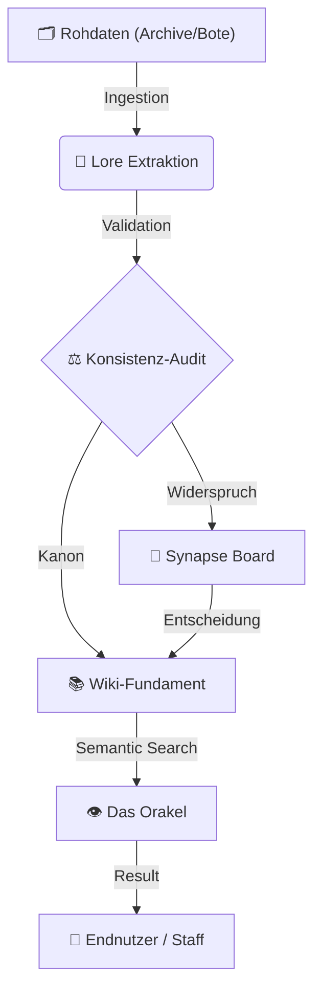

# <p align="center">⚔️ Siebenwind Lore Engine 2.0</p>

<p align="center">
  
</p>

<p align="center">
  <a href="https://github.com/Siebenwind/7w_wiki" target="_blank">
    
  </a>
  <a href="https://Siebenwind.github.io/7w_wiki/">
    
  </a>
  <a href="CHANGELOG.md">
    
  </a>
</p>

---

## 🏛️ Das Vermächtnis (The Core)

Willkommen in der **Siebenwind Lore Engine**. Dies ist kein gewöhnliches Wiki, sondern ein lebendes Denkmal für über **20 Jahre kollektive Kreativität**. 

Seit zwei Jahrzehnten weben Hunderte von Spielern und Stafflern an diesem Teppich aus Geschichten, Schicksalen und Welten. Unsere Mission ist es, dieses Erbe – diesen "Treasure Trove" menschlicher Kommunikation aus der Vor-AI-Ära – mit modernster Intelligenz zu bewahren, zu vernetzen und für die Zukunft sicherzustellen.

---

## 🧠 System-Architektur (The Wisdom Loop)

Das Projekt basiert auf einem kybernetischen Kreislauf der Wissensgenerierung:



---

## 📜 Die Goldenen Protokolle

| Sektion | Zweck | Dokumentation |
| :--- | :--- | :--- |
| **🧭 Navigation** | Der Einstieg in die Welt. | [Wiki-Startpunkt](Siebenwind_Wiki/index.md) |
| **🛠️ Setup** | Installation & Konfiguration. | [RAG / Orakel Architektur](setup_rag.md) |
| **📜 Philosophie** | Die "Trias Politica" des Systems. | [Architektur & Mission](architecture.md) |
| **📈 Fortschritt** | Was wurde bereits rekonstruiert? | [Master Task List](MASTER_TASK_LIST.md) |

---

## 🚀 Unified CLI: `7w_wiki.py`

Die gesamte Intelligenz des Systems ist in einem Werkzeug gebündelt:

```bash
# Suchen & Forschen
./7w_wiki.py search "Wer war Benedict Rabenfels?"
./7w_wiki.py historian "Benedict Rabenfels"

# Ingestion (Silicon Inquisition)
./7w_wiki.py inquisition --batch 10

# Qualität & Wartung
./7w_wiki.py audit        # Konsistenz-Check (Duplikate, Orphans)
./7w_wiki.py check        # Stil- & Grammatik-Prüfung (Lektor)
./7w_wiki.py sanitize     # Struktur-Korrektur (YAML/H1 Sync)
./7w_wiki.py score [file] # Lore Quality Score berechnen

# System & Archiv
./7w_wiki.py advisor      # Status & Empfehlungen
./7w_wiki.py archive sync # Archiv-Symlinks aktualisieren
./7w_wiki.py stats        # Statistiken generieren
```

---

## 🤝 Mitarbeit & Lizenz
Wir bewahren das Werk von Vielen. Wenn du Fehler findest oder Lore ergänzen möchtest:
- **Code:** [MIT License](https://github.com/Siebenwind/7w_wiki/blob/main/LICENSE)
- **Content:** CC BY-NC-SA 4.0 (Community Legacy)

*© 2026 Siebenwind Archivar-Kollektiv | Built for Intelligence, Driven by Legacy.*
