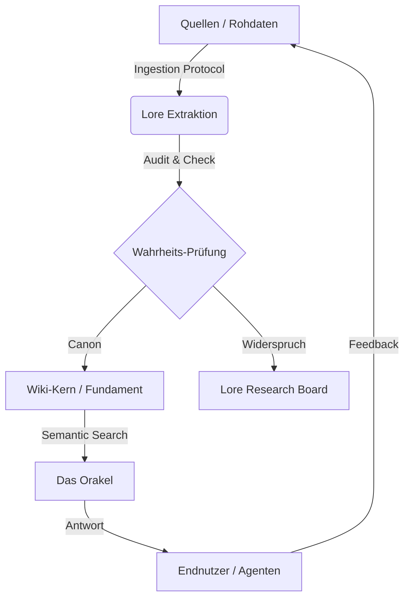

# <p align="center">⚔️ Siebenwind Lore Engine 2.0</p>

<p align="center">
  
</p>

<p align="center">
  <a href="https://github.com/LeCorbeau/7w_wiki">
    
  </a>
  <a href="https://LeCorbeau.github.io/7w_wiki/">
    
  </a>
  <a href="https://github.com/LeCorbeau/7w_wiki/blob/main/CHANGELOG.md">
    
  </a>
</p>

---

## 🏛️ Die Vision
Das zentrale Intelligenz-Framework für die Welt von Siebenwind. Dieses Projekt ist nicht nur ein Wiki, sondern eine **standardisierte Lore-Engine**, die 20 Jahre Rollenspielgeschichte durch eine KI-gestützte Architektur vereint, saniert und für die Zukunft bewahrt.

Die Engine dient als **Single Source of Truth** für Spieler, Geschichtenschreiber und KI-Agenten gleichermaßen.

---

## 🌐 Interaktive Erlebnisse

> [!TIP]
> **[Hier geht es zum interaktiven Siebenwind Wiki (Live Preview)](https://LeCorbeau.github.io/7w_wiki/)**
> *MkDocs Material v9 | Durchsuchbar | Mobiloptimiert | Dunkelmodus*

---

## 🧠 Die Lore-Architektur (Wisdom Loop)

Das System funktioniert als geschlossener Kreislauf aus Extraktion, Validierung und Wissensaufbau:



---

## 🚀 Unified CLI: Der Entry-Point `7w.py`

Wir haben alle Intelligenz-Tools in einer zentralen Schnittstelle gebündelt. Dies erlaubt eine nahtlose Integration mit externen Anwendungen oder Shell-Automatisierungen.

### 📚 Nutzung (Beispiele)
```bash
# SYSTEM STATUS & DASHBOARD
./7w.py  # Führt Diagnose aus & zeigt offene Tasks

# Lore-Suche (Orakel)
./7w.py search "Wer gründete den Löwenorden?"

# Konsistenz-Audit & Register-Cleanup
./7w.py audit
./7w.py repair

# KI-Delegation (Token-Schonung)
./7w.py delegate --scout --source forum
```

---

## 🏗️ Struktur des Repositories

| Kategorie | Verzeichnis | Beschreibung |
| :--- | :--- | :--- |
| **Lore-Content** | `/Siebenwind_Wiki/` | Das Herzstück – 100% Markdown-Wiki. |
| **Agentic Brain** | `/.agent/` | Workflows, Skills, Prompts & Lore-Gedächtnis. |
| **Intelligence** | `/System/` | Python-Logik, Orakel-Vektoren & Audit-Scripts. |
| **Rohmaterial** | `/Quellen/` | Digitalisierte Boten, Zeitzeugnisse & Forum-Archiv. |

---

## 💻 Für Entwickler & KI-Agenten

Dieses Repository ist **AI-Native**. Jede Datei folgt strikten Konventionen (YAML Metadata, Epistemische Tags), um eine optimale maschinelle Lesbarkeit und semantische Vernetzung zu gewährleisten.

### Installation & Setup
1. Repository klonen
2. Abhängigkeiten installieren: `pip install -r requirements.txt`
3. Wiki lokal starten: `mkdocs serve`

---

*© 2026 Siebenwind Chronisten-Gilde | Engineered for Intelligence*
