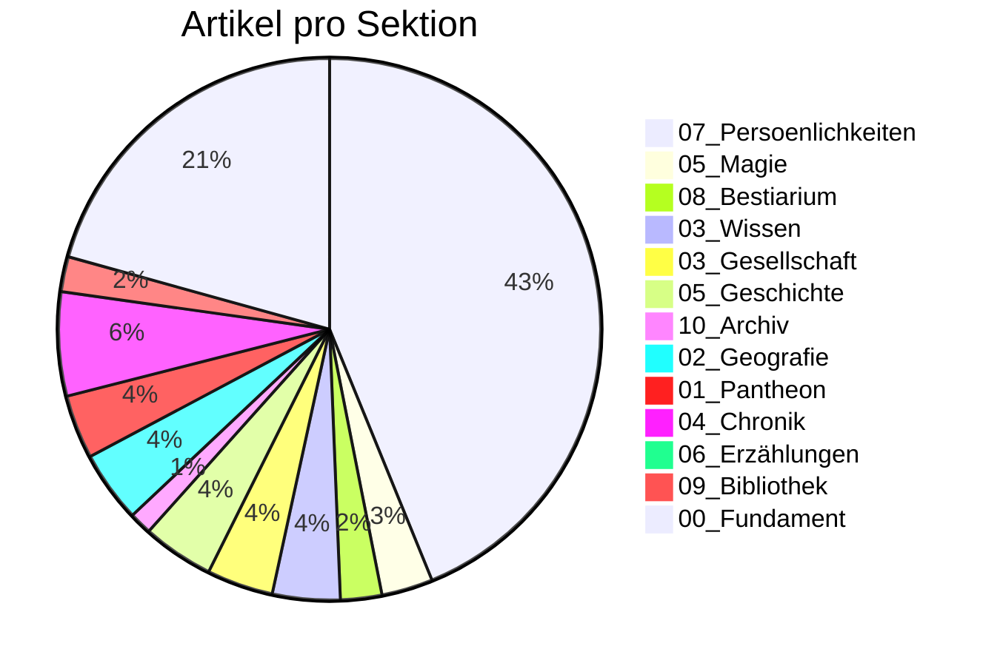

# 📊 Siebenwind Kompass

**Stand:** 2026-03-06 17:21

> Wissenswetter: **Windig: deutlich in Arbeit, noch sichtbar rau.**

---

## 🌍 Welt Heute

| Kennzahl | Wert |
| :--- | :--- |
| Artikel | **1356** |
| Worte | **190,867** |
| Durchschnittliche Artikellaenge | **141 Worte** |
| Interne Verweise (`[[...]]`) | **13,924** |
| Vernetzungsdichte | **10.3 Links/Artikel** |
| Personenprofile | **587** |

---

## 🔄 Was sich bewegt

| Zeitraum | Bearbeitete Wiki-Artikel | Neue Wiki-Artikel | Commits |
| :--- | :--- | :--- | :--- |
| Letzte 7 Tage | 0 | - | - |
| Letzte 30 Tage | 1350 | 1337 | 114 |
| Letzte 90 Tage | 1350 | - | - |

---

## 🧭 Sektionen

## 📚 Lesetiefe nach Sektion (Top 5)

| Sektion | Artikel | Ø Worte/Artikel | Ø Links/Artikel |
| :--- | ---: | ---: | ---: |
| `01_Pantheon` | 51 | 424 | 11.1 |
| `05_Magie` | 41 | 279 | 10.6 |
| `04_Chronik` | 83 | 272 | 33.9 |
| `03_Wissen` | 54 | 271 | 10.5 |
| `Root` | 1 | 258 | 0.0 |

---

## 🏆 Entdecke die Welt

### Starke Knoten (gesamt)
| Entitaet | Verweise |
| :--- | ---: |
| [[Siebenwind]] | 779 |
| [[Falkensee]] | 545 |
| [[Brandenstein]] | 469 |
| [[Bellum]] | 164 |
| [[Astrael]] | 149 |
| [[Nortraven]] | 144 |
| [[Toran_Dur]] | 142 |

### Praegende Persoenlichkeiten
| Persoenlichkeit | Verweise |
| :--- | ---: |
| [[Toran_Dur]] | 142 |
| [[Geist]] | 125 |
| [[Custodias]] | 83 |
| [[Waldemar_Delarie]] | 60 |
| [[Dunvallo_Linari]] | 56 |
| [[Hagen_Robaar]] | 49 |
| [[Solos_Nhergas]] | 48 |

### Praegende Ereignisse
| Ereignis | Verweise |
| :--- | ---: |
| [[Siebenwind_Bote_175]] | 29 |
| [[Siebenwind_Bote_179]] | 28 |
| [[Siebenwind_Bote_173]] | 25 |
| [[Siebenwind_Bote_180]] | 24 |
| [[Siebenwind_Bote_172]] | 22 |
| [[Siebenwind_Bote_161]] | 21 |
| [[Siebenwind_Bote_174]] | 21 |

---

## ✅ Qualitaet & Vertrauen

| Qualitaetsindikator | Wert | Fortschritt |
| :--- | :--- | :--- |
| Frontmatter-Abdeckung | 1356/1356 | `##########` 100.0% |
| Aufgeloeste Quellenangabe (`quelle`) | 441/1356 | `###-------` 32.5% |
| Ingestion Tracking vollstaendig | 51/55 | `#########-` 92.7% |
| Ingestion Reports mit LQS | 53/55 | `##########` 96.4% |
| `[UNGEKLAERT]`-Marker (gesamt) | 252 | Beobachtung |

## Epistemische Verteilung
| Tag | Artikel |
| :--- | ---: |
| `#bote` | 588 |
| `#unbekannt` | 424 |
| `#canon` | 137 |
| `#ueberlieferung` | 108 |
| `#perspektive` | 98 |
| `#news` | 1 |

---

## 🛠️ Werkstattstatus (Transparenz)

| Metrik | Stand |
| :--- | :--- |
| Letzter Audit-Problemtotal | 5 |
| Delta zum vorigen Audit | +0 |
| Bridge-/Placeholder-Seiten | 252 |
| Davon ohne Ausnahme-Metadaten | 0 |
| Test-Suiten PASS | 0 |
| Test-Suiten FAIL | 0 |

### Letzte Test-Suites
| Suite | Ergebnis | PASS | FAIL | SKIP |
| :--- | :--- | ---: | ---: | ---: |

## 📍 Fortschritt Live Verfolgen
- Arbeitsprioritaeten: `MASTER_TASK_LIST.md`
- Change-Historie: `CHANGELOG.md`
- Tracking-Register: `Logs/INGESTION_TRACKING_REGISTER.md`
- Letzter Audit: `Logs/Archive/Audit_06aacd85-82f2-4256-997e-3b020863bb43.txt`
- Letzte Testreports: `Logs/Archive/TEST_*.md`

---
> [!NOTE]
> Diese Seite ist leserzentriert. Technische Tiefendaten bleiben in den Log- und Board-Artefakten.
