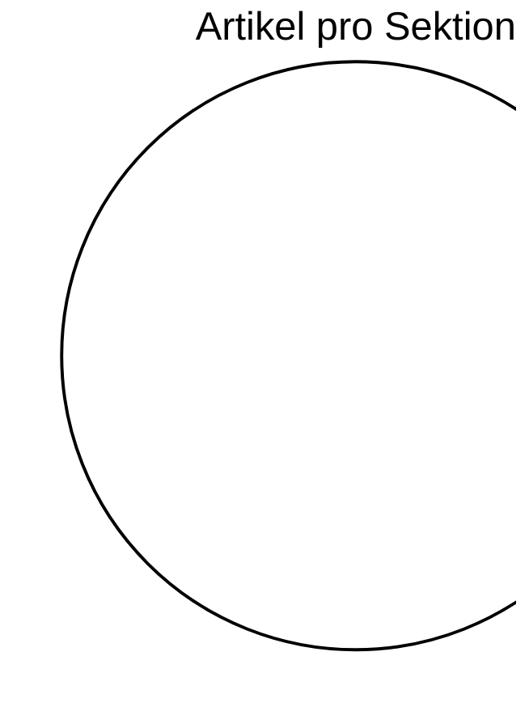

# 📊 Siebenwind Kompass

**Stand:** 2026-03-10 13:31

> Wissenswetter: **Klar: stabile Wissenslage mit kontrollierter Werkstattlast.**

---

## 🌍 Welt Heute

| Kennzahl | Wert |
| :--- | :--- |
| Artikel | **0** |
| Worte | **0** |
| Durchschnittliche Artikellaenge | **0 Worte** |
| Interne Verweise (`[[...]]`) | **0** |
| Vernetzungsdichte | **0.0 Links/Artikel** |
| Personenprofile | **0** |

---

## 🔄 Was sich bewegt

| Zeitraum | Bearbeitete Wiki-Artikel | Neue Wiki-Artikel | Commits |
| :--- | :--- | :--- | :--- |
| Letzte 7 Tage | 1307 | - | - |
| Letzte 30 Tage | 1350 | 1337 | 117 |
| Letzte 90 Tage | 1350 | - | - |

---

## 🧭 Sektionen

## 📚 Lesetiefe nach Sektion (Top 5)

| Sektion | Artikel | Ø Worte/Artikel | Ø Links/Artikel |
| :--- | ---: | ---: | ---: |

---

## 🏆 Entdecke die Welt

### Starke Knoten (gesamt)
| Entitaet | Verweise |
| :--- | ---: |

### Praegende Persoenlichkeiten
| Persoenlichkeit | Verweise |
| :--- | ---: |

### Praegende Ereignisse
| Ereignis | Verweise |
| :--- | ---: |

---

## ✅ Qualitaet & Vertrauen

| Qualitaetsindikator | Wert | Fortschritt |
| :--- | :--- | :--- |
| Frontmatter-Abdeckung | 0/0 | `----------` 0.0% |
| Aufgeloeste Quellenangabe (`quelle`) | 0/0 | `----------` 0.0% |
| Ingestion Tracking vollstaendig | 55/55 | `##########` 100.0% |
| Ingestion Reports mit LQS | 53/55 | `##########` 96.4% |
| `[UNGEKLAERT]`-Marker (gesamt) | 0 | Beobachtung |

## Epistemische Verteilung
| Tag | Artikel |
| :--- | ---: |

---

## 🛠️ Werkstattstatus (Transparenz)

| Metrik | Stand |
| :--- | :--- |
| Letzter Audit-Problemtotal | 74 |
| Delta zum vorigen Audit | +0 |
| Bridge-/Placeholder-Seiten | 0 |
| Davon ohne Ausnahme-Metadaten | 0 |
| Test-Suiten PASS | 0 |
| Test-Suiten FAIL | 0 |

### Letzte Test-Suites
| Suite | Ergebnis | PASS | FAIL | SKIP |
| :--- | :--- | ---: | ---: | ---: |

## 📍 Fortschritt Live Verfolgen
- Arbeitsprioritaeten: `MASTER_TASK_LIST.md`
- Change-Historie: `CHANGELOG.md`
- Tracking-Register: `Logs/INGESTION_TRACKING_REGISTER.md`
- Letzter Audit: `Logs/Archive/Audit_e0413255-a65c-42ff-a567-888a21b7ccfe.txt`
- Letzte Testreports: `Logs/Archive/TEST_*.md`

---
> [!NOTE]
> Diese Seite ist leserzentriert. Technische Tiefendaten bleiben in den Log- und Board-Artefakten.
