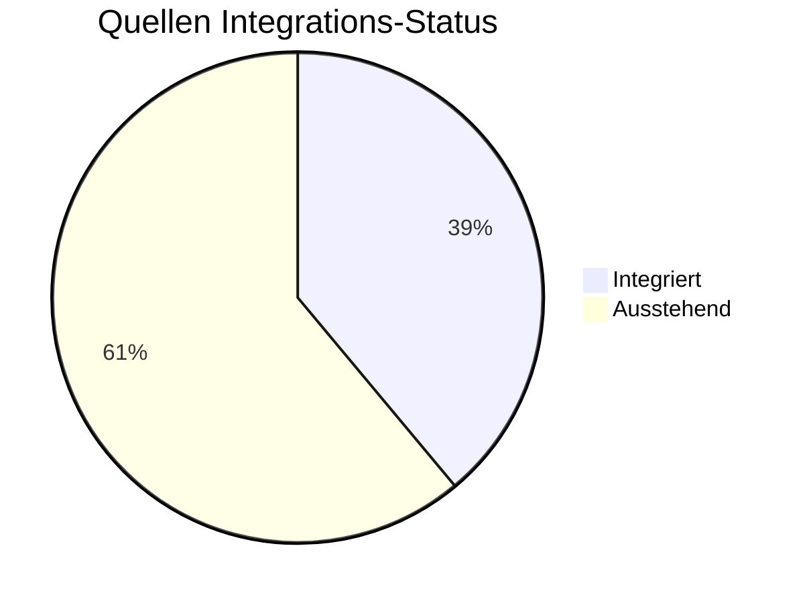
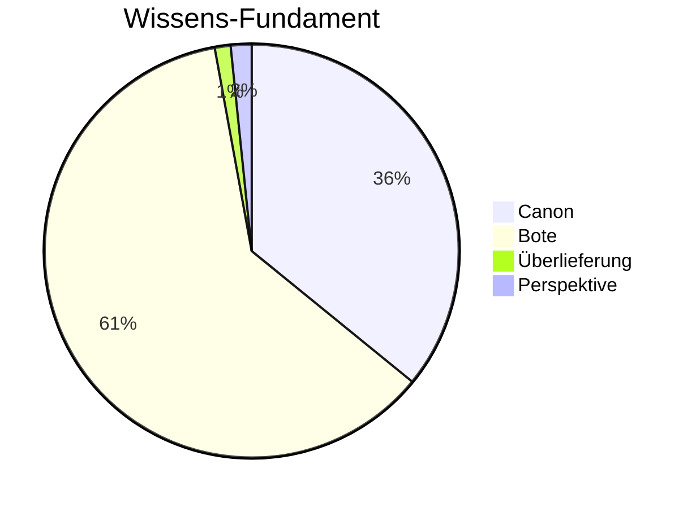

# Wiki Statistiken

**Letztes Update:** 2026-02-13 19:42:45

## 📊 High-Level KPIs

| Metrik | Wert |
| :--- | :--- |
| **Gesamtanzahl Artikel** | 666 |
| **Bekannte Persönlichkeiten** | 349 |
| **Gesamtwortzahl** | 97,981 |
| **Vernetzungsgrad (Links/1k Worte)** | 71.97 |

---

## 📥 Ingestions-Status (Quellen)



---

## 📂 Verteilung nach Kategorien

```mermaid
bar-chart
    title Artikel pro Kategorie
    x-axis [ "Root", "07_Persoenlichkeiten", "08_Bestiarium", "03_Gesellschaft", "05_Geschichte", "10_Archiv", "02_Geografie", "01_Pantheon", "04_Chronik", "06_Erzählungen", "06_Myten_und_Legenden", "09_Bibliothek", "00_Fundament" ]
    y-axis Artikel [ 1, 349, 27, 45, 50, 5, 50, 25, 78, 9, 1, 3, 23 ]
```

---

## ⚖️ Epistemische Sicherheit



---

## ⏳ Lore-Evolution (Zeitliche Dichte)
Häufigkeit der Erwähnung von Jahren in der Zeitrechnung "n.H.".

```mermaid
xychart-beta
    title Erwähnungen pro Jahr (n.H.)
    x-axis [ "16", "17", "18", "19", "20", "21", "22", "23", "25", "26", "28", "29", "30", "123", "165" ]
    y-axis "Nennungen"
    bar [ 151, 119, 236, 165, 177, 118, 64, 14, 5, 7, 15, 61, 79, 9, 2 ]
```

---

## 🏆 Zentrale Wissensknoten (Top Hubs)
Die am häufigsten verlinkten Artikel im Wiki.

| Rang | Entität | Verlinkungen |
| :--- | :--- | :--- |
| 1 | [[Falkensee]] | 310 |
| 2 | [[Brandenstein]] | 301 |
| 3 | [[Siebenwind]] | 277 |
| 4 | [[Nortraven]] | 76 |
| 5 | [[Custodias]] | 62 |
| 6 | [[Bellum]] | 61 |
| 7 | [[Vitama]] | 61 |
| 8 | [[Kirche_der_Viere]] | 57 |
| 9 | [[Ecclesia_Elementorum]] | 57 |
| 10 | [[Tare]] | 50 |

---
> [!NOTE]
> Diese Seite wird automatisch generiert. Sie dient der Übersicht über das Wachstum und die Qualität des Wissensarchivs.
