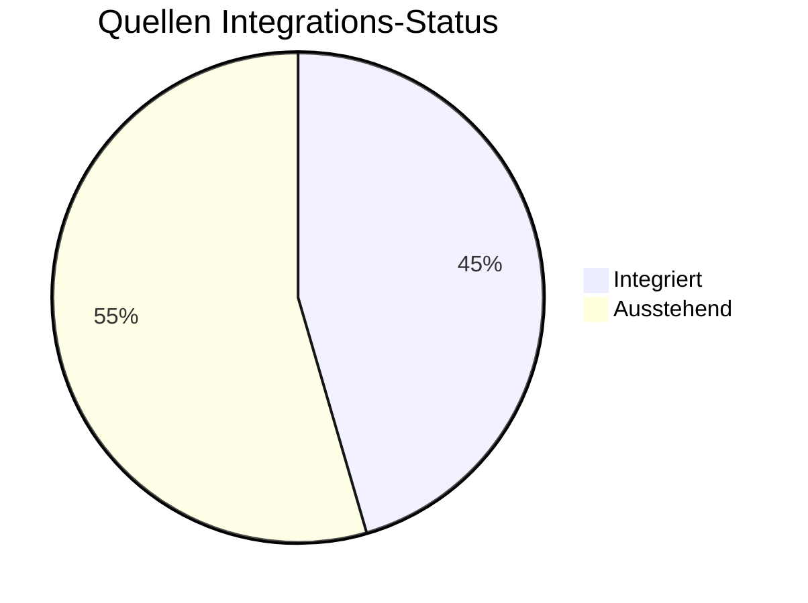

# Wiki Statistiken

**Letztes Update:** 2026-02-13 22:26:04

## 📊 High-Level KPIs

| Metrik | Wert |
| :--- | :--- |
| **Gesamtanzahl Artikel** | 674 |
| **Bekannte Persönlichkeiten** | 348 |
| **Gesamtwortzahl** | 100,425 |
| **Vernetzungsgrad (Links/1k Worte)** | 71.61 |

---

## 📥 Ingestions-Status (Quellen)



---

## 📂 Verteilung nach Kategorien

```mermaid
bar-chart
    title Artikel pro Kategorie
    x-axis [ "Root", "07_Persoenlichkeiten", "08_Bestiarium", "03_Gesellschaft", "05_Geschichte", "10_Archiv", "02_Geografie", "01_Pantheon", "04_Chronik", "06_Erzählungen", "06_Myten_und_Legenden", "09_Bibliothek", "00_Fundament" ]
    y-axis Artikel [ 1, 348, 31, 48, 51, 5, 50, 25, 79, 9, 1, 3, 23 ]
```

---

## ⚖️ Epistemische Sicherheit


---

## ⏳ Lore-Evolution (Zeitliche Dichte)
Häufigkeit der Erwähnung von Jahren in der Zeitrechnung "n.H.".

```mermaid
xychart-beta
    title Erwähnungen pro Jahr (n.H.)
    x-axis [ "17", "18", "19", "20", "21", "22", "23", "25", "26", "28", "29", "30", "36", "123", "165" ]
    y-axis "Nennungen"
    bar [ 117, 233, 154, 169, 145, 64, 14, 5, 7, 15, 60, 78, 8, 9, 2 ]
```

---

## 🏆 Zentrale Wissensknoten (Top Hubs)
Die am häufigsten verlinkten Artikel im Wiki.

| Rang | Entität | Verlinkungen |
| :--- | :--- | :--- |
| 1 | [[Falkensee]] | 324 |
| 2 | [[Brandenstein]] | 302 |
| 3 | [[Siebenwind]] | 278 |
| 4 | [[Nortraven]] | 77 |
| 5 | [[Custodias]] | 69 |
| 6 | [[Bellum]] | 61 |
| 7 | [[Vitama]] | 60 |
| 8 | [[Kirche_der_Viere]] | 58 |
| 9 | [[Ecclesia_Elementorum]] | 52 |
| 10 | [[Dwarschim]] | 50 |

---

## 📅 Aktivität (Letzte Änderungen)

| Zeitraum | Neue Artikel | Geänderte Artikel |
| :--- | :--- | :--- |
| **Letzte 24h** | 176 | 126 |
| **Letzte 7 Tage** | 657 | 129 |
| **Letzte 30 Tage** | 657 | 129 |

### Letzte Änderungen

| Datum | Aktion | Artikel | Kategorie |
| :--- | :--- | :--- | :--- |
| 2026-02-13 | Geändert | Personenregister | 00_Fundament |
| 2026-02-13 | Geändert | Merros | 01_Pantheon |
| 2026-02-13 | Geändert | Ecclesia Elementorum | 03_Gesellschaft |
| 2026-02-13 | Neu | Schattenhand | 03_Gesellschaft |
| 2026-02-13 | Geändert | Schattenjaeger | 03_Gesellschaft |
| 2026-02-13 | Neu | Tempelwache Falkensee | 03_Gesellschaft |
| 2026-02-13 | Geändert | Zeitleiste (15-30 n.H.) | 04_Chronik |
| 2026-02-13 | Neu | Trollkrieg von Brandenstein | 05_Geschichte |
| 2026-02-13 | Geändert | Zeitstrahl | 05_Geschichte |
| 2026-02-13 | Geändert | Emanuel | 07_Persoenlichkeiten |
| 2026-02-13 | Geändert | Ionas | 07_Persoenlichkeiten |
| 2026-02-13 | Neu | Kharas Palanthas | 07_Persoenlichkeiten |
| 2026-02-13 | Geändert | Serass | 07_Persoenlichkeiten |
| 2026-02-13 | Geändert | Sorania | 07_Persoenlichkeiten |
| 2026-02-13 | Neu | Bestie von Brandenstein | 08_Bestiarium |

---
> [!NOTE]
> Diese Seite wird automatisch generiert. Sie dient der Übersicht über das Wachstum und die Qualität des Wissensarchivs.
