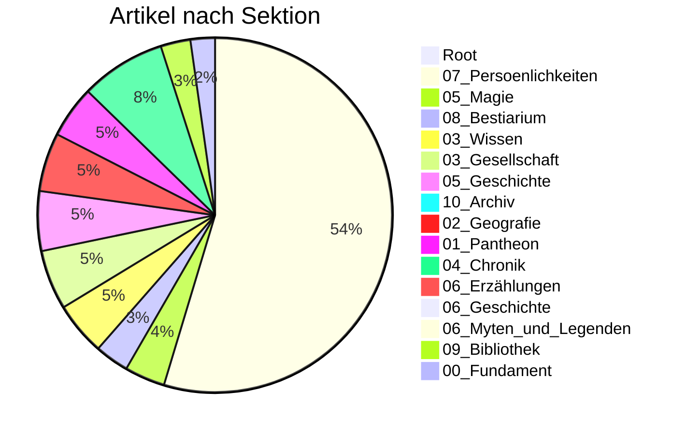

# 📊 Wiki Status

**Letztes Update:** 2026-02-14 23:26:04

---

## 🏛️ Kern-Metriken

| Metrik | Wert |
| :--- | :--- |
| **Artikel** | 1047 |
| **Worte (Gesamt)** | 169,323 |
| **Vernetzung** | 51.07 Links/1k |
| **Persönlichkeiten** | 563 |

---

## 📂 Kategorien

---

## 🏆 Top Hubs
Die am stärksten vernetzten Artikel.

| Entität | Links |
| :--- | :--- |
| [[Falkensee]] | 338 |
| [[Brandenstein]] | 322 |
| [[Siebenwind]] | 275 |
| [[Personenregister]] | 127 |
| [[Nortraven]] | 77 |

---
> [!NOTE]
> Fokus auf Essenz. Weniger Rauschen, mehr Lore.
