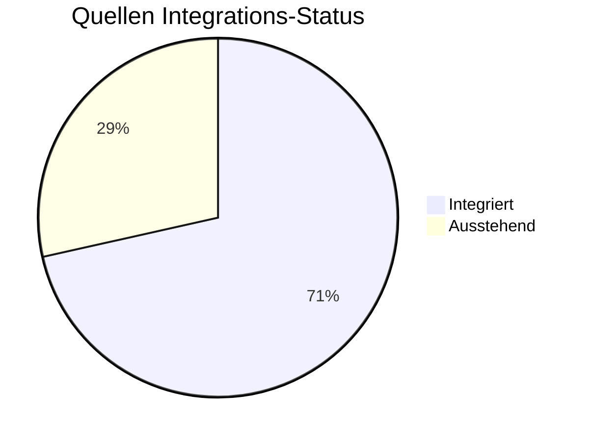
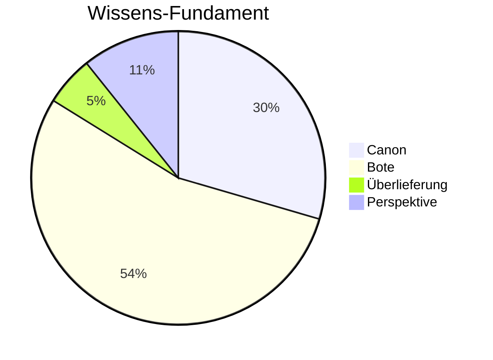

# Wiki Statistiken

**Letztes Update:** 2026-02-14 05:30:36

## 📊 High-Level KPIs

| Metrik | Wert |
| :--- | :--- |
| **Gesamtanzahl Artikel** | 923 |
| **Bekannte Persönlichkeiten** | 520 |
| **Gesamtwortzahl** | 143,402 |
| **Vernetzungsgrad (Links/1k Worte)** | 56.79 |

---

## 📥 Ingestions-Status (Quellen)



---

## 📂 Verteilung nach Kategorien

```mermaid
bar-chart
    title Artikel pro Kategorie
    x-axis [ "Root", "07_Persoenlichkeiten", "05_Magie", "08_Bestiarium", "03_Gesellschaft", "05_Geschichte", "10_Archiv", "02_Geografie", "01_Pantheon", "04_Chronik", "06_Erzählungen", "06_Geschichte", "06_Myten_und_Legenden", "09_Bibliothek", "00_Fundament" ]
    y-axis Artikel [ 1, 520, 12, 32, 55, 56, 5, 52, 49, 79, 9, 1, 1, 28, 23 ]
```

---

## ⚖️ Epistemische Sicherheit



---

## ⏳ Lore-Evolution (Zeitliche Dichte)
Häufigkeit der Erwähnung von Jahren in der Zeitrechnung "n.H.".

```mermaid
xychart-beta
    title Erwähnungen pro Jahr (n.H.)
    x-axis [ "18", "19", "20", "21", "22", "23", "24", "25", "26", "28", "29", "30", "36", "123", "165" ]
    y-axis "Nennungen"
    bar [ 237, 165, 174, 216, 93, 14, 2, 4, 7, 14, 65, 81, 10, 9, 2 ]
```

---

## 🏆 Top 10 Best-Dokumentierte Persönlichkeiten
(Basierend auf geschätztem Umfang/Relevanz)

| Rang | Persönlichkeit | Umfang (Worte) | Links |
| :--- | :--- | :--- | :--- |
| 1 | [[Waldemar_Delarie]] | 626 | 48 |
| 2 | [[Toran_Dur]] | 540 | 45 |
| 3 | [[Custodias]] | 445 | 71 |
| 4 | [[Aspin_Schwertklinge_von_Fahlenau]] | 322 | 8 |
| 5 | [[Haldur_Toda]] | 310 | 5 |
| 6 | [[Hilgorad_I_ap_Mer]] | 307 | 23 |
| 7 | [[Thorgat]] | 292 | 3 |
| 8 | [[Veridon]] | 288 | 6 |
| 9 | [[Calmexistus_Salanus]] | 283 | 15 |
| 10 | [[Ionas]] | 273 | 9 |

---

## 🔗 Zentrale Wissensknoten (Top Hubs)
Die am häufigsten verlinkten Artikel im Wiki.

| Rang | Entität | Verlinkungen |
| :--- | :--- | :--- |
| 1 | [[Falkensee]] | 337 |
| 2 | [[Brandenstein]] | 313 |
| 3 | [[Siebenwind]] | 269 |
| 4 | [[Personenregister]] | 112 |
| 5 | [[Nortraven]] | 77 |
| 6 | [[Bellum]] | 76 |
| 7 | [[Custodias]] | 71 |
| 8 | [[Angamon]] | 70 |
| 9 | [[Vitama]] | 69 |
| 10 | [[Kirche_der_Viere]] | 56 |

---

## 📅 Aktivität (Letzte Änderungen)

| Zeitraum | Neue Artikel | Geänderte Artikel |
| :--- | :--- | :--- |
| **Letzte 24h** | 341 | 217 |
| **Letzte 7 Tage** | 825 | 223 |
| **Letzte 30 Tage** | 825 | 223 |

### Letzte Änderungen

| Datum | Aktion | Artikel | Kategorie |
| :--- | :--- | :--- | :--- |
| 2026-02-14 | Geändert | Die Monde | 00_Fundament |
| 2026-02-14 | Geändert | Die Sprache Run | 00_Fundament |
| 2026-02-14 | Geändert | Magietheorie Toran Dur | 00_Fundament |
| 2026-02-14 | Geändert | Organisationsregister | 00_Fundament |
| 2026-02-14 | Geändert | Personenregister | 00_Fundament |
| 2026-02-14 | Geändert | Brevier Ordo Belli | 01_Pantheon |
| 2026-02-14 | Geändert | Brevier Ordo Morsanes | 01_Pantheon |
| 2026-02-14 | Geändert | Brevier Ordo Vitamae | 01_Pantheon |
| 2026-02-14 | Geändert | Burg Finianswacht | 02_Geografie |
| 2026-02-14 | Geändert | Region Sae | 02_Geografie |
| 2026-02-14 | Geändert | Saeulenmeer | 02_Geografie |
| 2026-02-14 | Neu | Weteka | 02_Geografie |
| 2026-02-14 | Geändert | Grosser Rat | 03_Gesellschaft |
| 2026-02-14 | Geändert | Hafengilde Brandenstein | 03_Gesellschaft |
| 2026-02-14 | Geändert | Oculus Ecclesiae | 03_Gesellschaft |

---
> [!NOTE]
> Diese Seite wird automatisch generiert. Sie dient der Übersicht über das Wachstum und die Qualität des Wissensarchivs.
