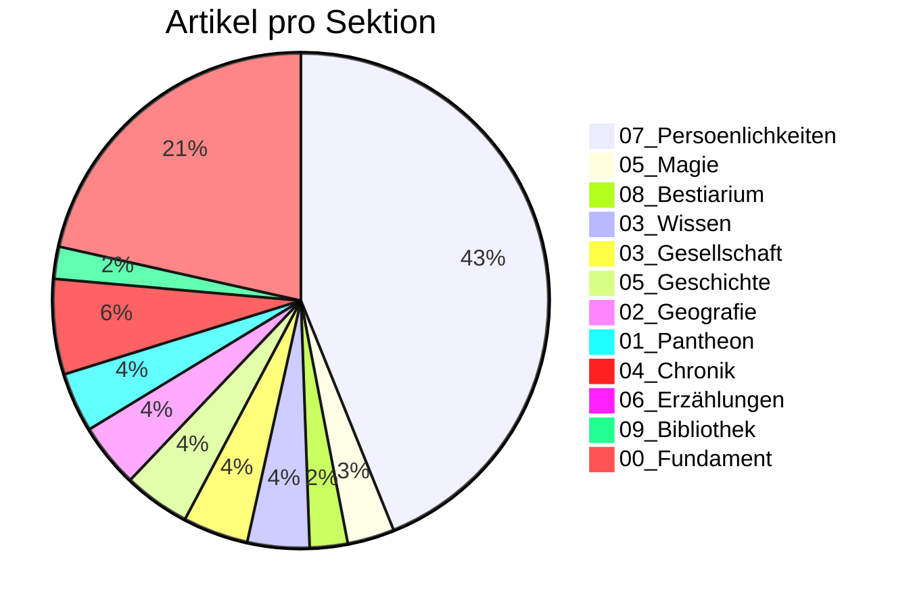

# 📊 Siebenwind Kompass

**Stand:** 2026-02-18 01:07

> Wissenswetter: **Stuermisch: viele offene Baustellen, aber aktive Bewegung.**

---

## 🌍 Welt Heute

| Kennzahl | Wert |
| :--- | :--- |
| Artikel | **1360** |
| Worte | **188,405** |
| Durchschnittliche Artikellaenge | **139 Worte** |
| Interne Verweise (`[[...]]`) | **15,018** |
| Vernetzungsdichte | **11.0 Links/Artikel** |
| Personenprofile | **586** |

---

## 🔄 Was sich bewegt

| Zeitraum | Bearbeitete Wiki-Artikel | Neue Wiki-Artikel | Commits |
| :--- | :--- | :--- | :--- |
| Letzte 7 Tage | 1335 | - | - |
| Letzte 30 Tage | 1335 | 1332 | 95 |
| Letzte 90 Tage | 1335 | - | - |

---

## 🧭 Sektionen

## 📚 Lesetiefe nach Sektion (Top 5)

| Sektion | Artikel | Ø Worte/Artikel | Ø Links/Artikel |
| :--- | ---: | ---: | ---: |
| `01_Pantheon` | 52 | 411 | 13.3 |
| `06_Erzählungen` | 13 | 328 | 12.7 |
| `Root` | 1 | 285 | 1.0 |
| `05_Magie` | 41 | 279 | 14.2 |
| `04_Chronik` | 83 | 271 | 35.3 |

---

## 🏆 Entdecke die Welt

### Starke Knoten (gesamt)
| Entitaet | Verweise |
| :--- | ---: |
| [[Siebenwind]] | 705 |
| [[Falkensee]] | 543 |
| [[Brandenstein]] | 465 |
| [[Astrael]] | 192 |
| [[Toran Dur]] | 173 |
| [[Bellum]] | 165 |
| [[Nortraven]] | 144 |

### Praegende Persoenlichkeiten
| Persoenlichkeit | Verweise |
| :--- | ---: |
| [[Toran_Dur]] | 173 |
| [[Geist]] | 125 |
| [[Custodias]] | 83 |
| [[Waldemar_Delarie]] | 60 |
| [[Dunvallo_Linari]] | 53 |
| [[Hagen_Robaar]] | 49 |
| [[Solos_Nhergas]] | 48 |

### Praegende Ereignisse
| Ereignis | Verweise |
| :--- | ---: |
| [[Siebenwind_Bote_175]] | 29 |
| [[Blutschwert]] | 28 |
| [[Siebenwind_Bote_179]] | 28 |
| [[Das_Ende_der_Zeit_der_Koenige]] | 28 |
| [[Siebenwind_Bote_173]] | 25 |
| [[Siebenwind_Bote_180]] | 24 |
| [[Siebenwind_Bote_172]] | 22 |

---

## ✅ Qualitaet & Vertrauen

| Qualitaetsindikator | Wert | Fortschritt |
| :--- | :--- | :--- |
| Frontmatter-Abdeckung | 1360/1360 | `##########` 100.0% |
| Aufgeloeste Quellenangabe (`quelle`) | 440/1360 | `###-------` 32.4% |
| Ingestion Tracking vollstaendig | 50/54 | `#########-` 92.6% |
| Ingestion Reports mit LQS | 52/54 | `##########` 96.3% |
| `[UNGEKLAERT]`-Marker (gesamt) | 252 | Beobachtung |

## Epistemische Verteilung
| Tag | Artikel |
| :--- | ---: |
| `#bote` | 592 |
| `#unbekannt` | 423 |
| `#canon` | 135 |
| `#ueberlieferung` | 107 |
| `#perspektive` | 102 |
| `#news` | 1 |

---

## 🛠️ Werkstattstatus (Transparenz)

| Metrik | Stand |
| :--- | :--- |
| Letzter Audit-Problemtotal | 437 |
| Delta zum vorigen Audit | +0 |
| Bridge-/Placeholder-Seiten | 89 |
| Davon ohne Ausnahme-Metadaten | 89 |
| Test-Suiten PASS | 7 |
| Test-Suiten FAIL | 1 |

### Letzte Test-Suites
| Suite | Ergebnis | PASS | FAIL | SKIP |
| :--- | :--- | ---: | ---: | ---: |
| `bridge-placeholder-guard` | **PASS** | 2 | 0 | 0 |
| `clean-client-state` | **PASS** | 8 | 0 | 0 |
| `interop-doc-links` | **PASS** | 1 | 0 | 0 |
| `process-dispatch-curiosity` | **PASS** | 1 | 0 | 0 |
| `rag-relevance-smoke` | **FAIL** | 1 | 3 | 0 |
| `reader-stats-contract` | **PASS** | 2 | 0 | 0 |
| `source-link-hygiene` | **PASS** | 1 | 0 | 0 |
| `takeover-handover` | **PASS** | 5 | 0 | 0 |

## 📍 Fortschritt Live Verfolgen
- Arbeitsprioritaeten: `MASTER_TASK_LIST.md`
- Change-Historie: `CHANGELOG.md`
- Tracking-Register: `Logs/INGESTION_TRACKING_REGISTER.md`
- Letzter Audit: `Logs/Archive/Audit_14de6856-3365-45ee-af46-370ff11b468a.txt`
- Letzte Testreports: `Logs/Archive/TEST_*.md`

---
> [!NOTE]
> Diese Seite ist leserzentriert. Technische Tiefendaten bleiben in den Log- und Board-Artefakten.
