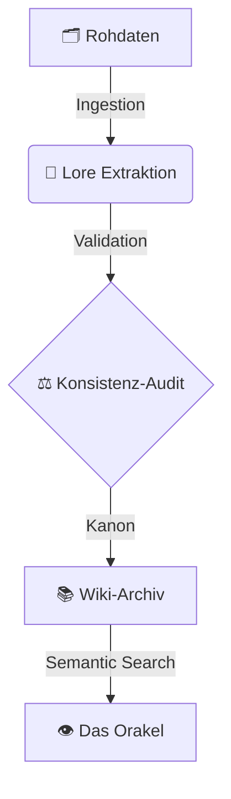

  
Das Archiv

  <h1 class="hero-title">Siebenwind Wiki</h1>
  
Willkommen im zentralen Wissensspeicher der Welt Siebenwind. Hier finden sich alle kanonischen Informationen, von den Göttern bis zur Geografie.

## Abteilungen

  <a href="00_Fundament/" class="portal-card"><h3>Fundament</h3>
Register, Völker & Magie.
</a>
  <a href="01_Pantheon/" class="portal-card"><h3>Pantheon</h3>
Götter & Religion.
</a>
  <a href="02_Geografie/" class="portal-card"><h3>Geografie</h3>
Atlas & Orte.
</a>
  <a href="03_Gesellschaft/" class="portal-card"><h3>Gesellschaft</h3>
Stände & Politik.
</a>
  <a href="04_Chronik/" class="portal-card"><h3>Chronik</h3>
Geschichte & Boten.
</a>
  <a href="07_Persoenlichkeiten/" class="portal-card"><h3>Personen</h3>
Who is Who.
</a>
  <a href="09_Bibliothek/" class="portal-card"><h3>Bibliothek</h3>
Werke & Schriften.
</a>
  <a href="10_Archiv/" class="portal-card"><h3>Archiv</h3>
Verwaltung & Stats.
</a>

## Projekt Status

  
  

### System-Architektur

*Stand: 2026 | LeCorbeau & Siebenwind*
