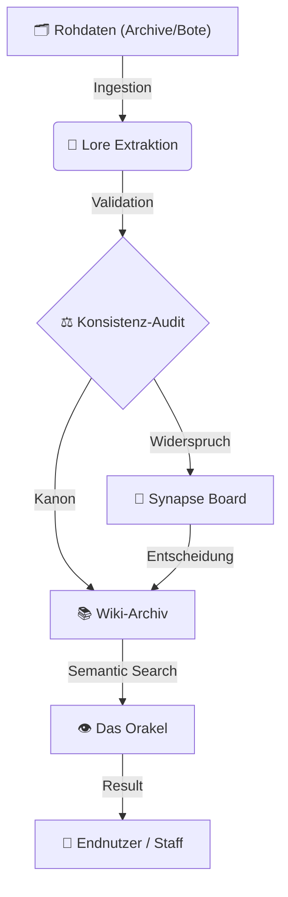

# Siebenwind Wiki

{ .wiki-banner }

<p align="center">
  <a href="https://github.com/Siebenwind/7w_wiki" target="_blank">
    
  </a>
  <a href="https://siebenwind.github.io/7w_wiki/">
    
  </a>
  <a href="../CHANGELOG.md">
    
  </a>
</p>

---

## Projekt-Hintergrund

Die [[Siebenwind]] Lore-Engine ist ein technisches Archiv zur Bewahrung und Erschliessung von Rollenspiel-Dokumentationen. Der Fokus liegt auf der quellengetreuen Rekonstruktion historischer Datenbestaende.

---

## 🧠 System-Architektur (The Wisdom Loop)

Das Projekt basiert auf einem kybernetischen Kreislauf der Wissensgenerierung:



---

## 📜 Die Goldenen Protokolle

| Sektion | Zweck | Dokumentation |
| :--- | :--- | :--- |
| **🧭 Navigation** | Der Einstieg in die Welt. | [Wiki-Startpunkt](index.md) |
| **🛠️ Setup** | Architektur des Orakels. | [Setup RAG](../setup_rag.md) |
| **📜 Philosophie** | Grundgesetze des Systems. | [Architektur](../architecture.md) |
| **📈 Fortschritt** | Rekonstruktions-Status. | [Master Task List](../MASTER_TASK_LIST.md) |

---

## 🚀 Unified CLI: `7w_wiki.py`

Die gesamte Intelligenz des Systems ist in einem Werkzeug gebündelt:

```bash
# Das Orakel abfragen
./7w_wiki.py search "Wer war Benedict Rabenfels?" --source all

# Den Konsistenz-Status prüfen
./7w_wiki.py audit

# Den Status des Archivars abrufen
./7w_wiki.py advisor
```

---

## Projekt-Metadaten
- **Entwicklung:** LeCorbeau & Siebenwind Gemeinschaft
- **Inhalte:** Autoren & Projekt Siebenwind
- **Lizenzen:** Code (MIT), Inhalte (CC BY-NC-SA 4.0)

*Stand: 2026 | LeCorbeau & Siebenwind*
