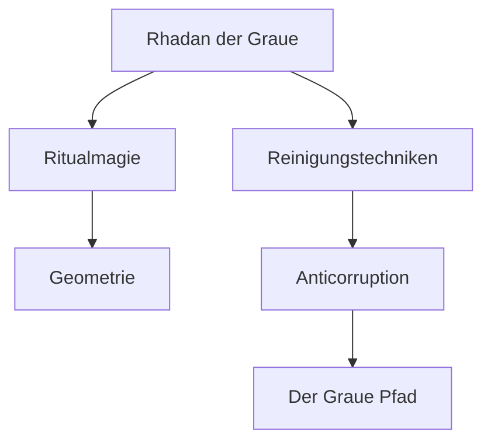

!!! note "Status: #überlieferung"
    Dieses Dossier basiert auf den fragmentarischen Überlieferungen des Turms zu Tiefenbach und den erhaltenen Schriften der "Rituallehre".

[!ABSTRACT]
Rhadan der Graue gilt als der Architekt der modernen Ritualmagie innerhalb des Grauen Pfades. Sein Werk konzentriert sich auf die Entropie-Minderung durch geometrische Präzision und die spirituelle Reinigung von magischen Räumen.

## I. Historischer Kontext
Rhadan lehrte am historischen **Turm zu Tiefenbach** (ca. 12-18 n.H.). In einer Ära, die von den Nachwehen der Vandrien-Krise und dem Aufstieg dunkler Kulte geprägt war, suchte er nach Wegen, die arkane Macht zu stabilisieren.

## II. Theoretische Kernpunkte
Seine Forschung befasste sich primär mit zwei Säulen:
1. **Geometrische Ritualistik:** Die Anordnung von Fokus-Steinen in bestimmten Winkeln zur Minimierung von Astral-Rauschen.
2. **Die "Bewegte Reinigung":** Ein dynamisches Verfahren zur Entfernung von Dämonischer Korruption aus Objekten und Personen.

## III. Vernetzung & Disziplinen
In Rhadans Theorie sind die Disziplinen wie folgt verknüpft:

## IV. Überlieferungen & Fragmente
Die wichtigsten erhaltenen Fragmente sind:
*   [[Rituallehre_Sphaeren|Die Ritualisierung]]
*   [[Ariin_(Rhadan_der_Graue)|Über die Erschaffung von Dienern]]

---
**Zugehörige Entität:** [[Rhadan_der_Graue]]
**Referenz-ID:** RESEARCH-2026-007
**Archivar:** Antigravity
