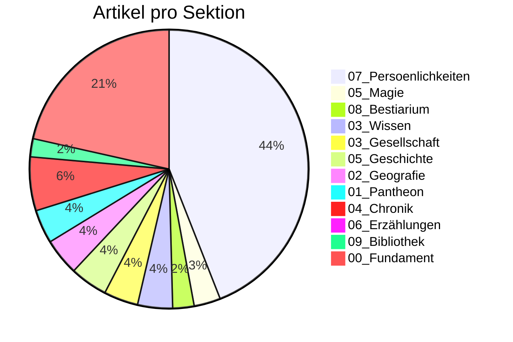

# 📊 Siebenwind Kompass

**Stand:** 2026-03-26 15:10

> Wissenswetter: **Windig: deutlich in Arbeit, noch sichtbar rau.**

---

## 🌍 Welt Heute

| Kennzahl | Wert |
| :--- | :--- |
| Artikel | **1356** |
| Worte | **186,866** |
| Durchschnittliche Artikellaenge | **138 Worte** |
| Interne Verweise (`[[...]]`) | **14,974** |
| Vernetzungsdichte | **11.0 Links/Artikel** |
| Personenprofile | **586** |

---

## 🔄 Was sich bewegt

| Zeitraum | Bearbeitete Wiki-Artikel | Neue Wiki-Artikel | Commits |
| :--- | :--- | :--- | :--- |
| Letzte 7 Tage | 0 | - | - |
| Letzte 30 Tage | 0 | 0 | 0 |
| Letzte 90 Tage | 1344 | - | - |

---

## 🧭 Sektionen

## 📚 Lesetiefe nach Sektion (Top 5)

| Sektion | Artikel | Ø Worte/Artikel | Ø Links/Artikel |
| :--- | ---: | ---: | ---: |
| `01_Pantheon` | 52 | 409 | 13.3 |
| `06_Erzählungen` | 13 | 326 | 12.7 |
| `Root` | 1 | 283 | 1.0 |
| `05_Magie` | 41 | 277 | 14.2 |
| `04_Chronik` | 83 | 270 | 35.3 |

---

## 🏆 Entdecke die Welt

### Starke Knoten (gesamt)
| Entitaet | Verweise |
| :--- | ---: |
| [[Siebenwind]] | 702 |
| [[Falkensee]] | 543 |
| [[Brandenstein]] | 466 |
| [[Astrael]] | 192 |
| [[Toran_Dur]] | 170 |
| [[Bellum]] | 165 |
| [[Nortraven]] | 144 |

### Praegende Persoenlichkeiten
| Persoenlichkeit | Verweise |
| :--- | ---: |
| [[Toran_Dur]] | 170 |
| [[Geist]] | 125 |
| [[Custodias]] | 83 |
| [[Waldemar_Delarie]] | 60 |
| [[Dunvallo_Linari]] | 53 |
| [[Hagen_Robaar]] | 49 |
| [[Solos_Nhergas]] | 48 |

### Praegende Ereignisse
| Ereignis | Verweise |
| :--- | ---: |
| [[Siebenwind_Bote_175]] | 29 |
| [[Blutschwert]] | 28 |
| [[Siebenwind_Bote_179]] | 28 |
| [[Das_Ende_der_Zeit_der_Koenige]] | 28 |
| [[Siebenwind_Bote_173]] | 25 |
| [[Siebenwind_Bote_180]] | 24 |
| [[Siebenwind_Bote_172]] | 22 |

---

## ✅ Qualitaet & Vertrauen

| Qualitaetsindikator | Wert | Fortschritt |
| :--- | :--- | :--- |
| Frontmatter-Abdeckung | 1356/1356 | `##########` 100.0% |
| Aufgeloeste Quellenangabe (`quelle`) | 437/1356 | `###-------` 32.2% |
| Ingestion Tracking vollstaendig | 55/55 | `##########` 100.0% |
| Ingestion Reports mit LQS | 53/55 | `##########` 96.4% |
| `[UNGEKLAERT]`-Marker (gesamt) | 251 | Beobachtung |

## 🔏 Drift & Provenance
| Kennzahl | Wert |
| :--- | :--- |
| Technischer Edit-Baum | `docs/Siebenwind_Wiki/` |
| Epistemische Praezedenz | `homepage > sources > wiki` |
| Homepage-Kanon | `https://www.siebenwind.de/` |
| Inventar | `.agent/data/wiki_inventory.json` |

## Epistemische Verteilung
| Tag | Artikel |
| :--- | ---: |
| `#bote` | 589 |
| `#unbekannt` | 422 |
| `#canon` | 135 |
| `#ueberlieferung` | 107 |
| `#perspektive` | 102 |
| `#news` | 1 |

---

## 🛠️ Werkstattstatus (Transparenz)

| Metrik | Stand |
| :--- | :--- |
| Letzter Audit-Problemtotal | 178 |
| Delta zum vorigen Audit | -792 |
| Bridge-/Placeholder-Seiten | 88 |
| Davon ohne Ausnahme-Metadaten | 88 |
| Test-Suiten PASS | 0 |
| Test-Suiten FAIL | 0 |

### Letzte Test-Suites
| Suite | Ergebnis | PASS | FAIL | SKIP |
| :--- | :--- | ---: | ---: | ---: |

## 📍 Fortschritt Live Verfolgen
- Arbeitsprioritaeten: `MASTER_TASK_LIST.md`
- Change-Historie: `CHANGELOG.md`
- Tracking-Register: `Logs/INGESTION_TRACKING_REGISTER.md`
- Letzter Audit: `Logs/Archive/Audit_e9972f7c-85ca-4e3c-8318-bc1f4035072d.txt`
- Letzte Testreports: `Logs/Archive/TEST_*.md`

---
> [!NOTE]
> Diese Seite ist leserzentriert. Technische Tiefendaten bleiben in den Log- und Board-Artefakten.
