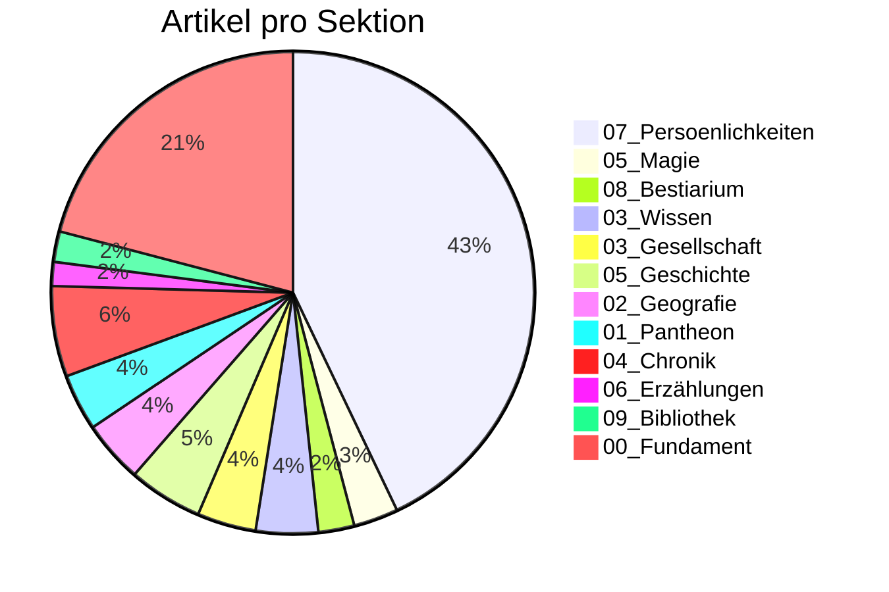

# 📊 Siebenwind Kompass

**Stand:** 2026-07-30 19:08

> Wissenswetter: **Windig: deutlich in Arbeit, noch sichtbar rau.**

---

## 🌍 Welt Heute

| Kennzahl | Wert |
| :--- | :--- |
| Artikel | **1380** |
| Worte | **193,826** |
| Durchschnittliche Artikellaenge | **140 Worte** |
| Interne Verweise (`[[...]]`) | **12,993** |
| Vernetzungsdichte | **9.4 Links/Artikel** |
| Personenprofile | **587** |

---

## 🔄 Was sich bewegt

| Zeitraum | Bearbeitete Wiki-Artikel | Neue Wiki-Artikel | Aktive Tage |
| :--- | :--- | :--- | :--- |
| Letzte 7 Tage | 0 | - | 0 |
| Letzte 30 Tage | 6 | 3 | 2 |
| Letzte 90 Tage | 6 | - | 3 |

---

## 🧭 Sektionen

## 📚 Lesetiefe nach Sektion (Top 5)

| Sektion | Artikel | Ø Worte/Artikel | Ø Links/Artikel |
| :--- | ---: | ---: | ---: |
| `01_Pantheon` | 52 | 410 | 11.2 |
| `06_Erzählungen` | 22 | 284 | 10.3 |
| `Root` | 1 | 283 | 1.0 |
| `05_Magie` | 41 | 276 | 9.8 |
| `04_Chronik` | 83 | 270 | 31.6 |

---

## 🏆 Entdecke die Welt

### Starke Knoten (gesamt)
| Entitaet | Verweise |
| :--- | ---: |
| [[Falkensee]] | 534 |
| [[Siebenwind]] | 508 |
| [[Brandenstein]] | 488 |
| [[Bellum]] | 169 |
| [[Astrael]] | 157 |
| [[Nortraven]] | 146 |
| [[Toran_Dur]] | 134 |

### Praegende Persoenlichkeiten
| Persoenlichkeit | Verweise |
| :--- | ---: |
| [[Toran_Dur]] | 134 |
| [[Custodias]] | 71 |
| [[Waldemar_Delarie]] | 54 |
| [[Dunvallo_Linari]] | 50 |
| [[Solos_Nhergas]] | 44 |
| [[Hagen_Robaar]] | 41 |
| [[Laske]] | 40 |

### Praegende Ereignisse
| Ereignis | Verweise |
| :--- | ---: |
| [[Siebenwind_Bote_172]] | 20 |
| [[Siebenwind_Bote_175]] | 19 |
| [[Siebenwind_Bote_186]] | 19 |
| [[Siebenwind_Bote_173]] | 18 |
| [[Siebenwind_Bote_180]] | 18 |
| [[Das_Ende_der_Zeit_der_Koenige]] | 17 |
| [[Der_Putsch_von_Falkensee]] | 17 |

---

## ✅ Qualitaet & Vertrauen

| Qualitaetsindikator | Wert | Fortschritt |
| :--- | :--- | :--- |
| Frontmatter-Abdeckung | 1380/1380 | `##########` 100.0% |
| Aufgeloeste Quellenangabe (`quelle`) | 464/1380 | `###-------` 33.6% |
| Ingestion Tracking vollstaendig | 85/85 | `##########` 100.0% |
| Ingestion Reports mit LQS | 83/85 | `##########` 97.6% |
| `[UNGEKLAERT]`-Marker (gesamt) | 279 | Beobachtung |

## 🔏 Drift & Provenance
| Kennzahl | Wert |
| :--- | :--- |
| Technischer Edit-Baum | `docs/Siebenwind_Wiki/` |
| Epistemische Praezedenz | `homepage > sources > wiki` |
| Homepage-Kanon | `https://www.siebenwind.de/` |
| Inventar | `.agent/data/wiki_inventory.json` |

## Epistemische Verteilung
| Tag | Artikel |
| :--- | ---: |
| `#bote` | 589 |
| `#unbekannt` | 419 |
| `#canon` | 138 |
| `#perspektive` | 125 |
| `#ueberlieferung` | 108 |
| `#news` | 1 |

---

## 🛠️ Werkstattstatus (Transparenz)

| Metrik | Stand |
| :--- | :--- |
| Letzter Audit-Problemtotal | 0 |
| Delta zum vorigen Audit | +0 |
| Bridge-/Placeholder-Seiten | 85 |
| Davon ohne Ausnahme-Metadaten | 0 |
| Test-Suiten PASS | 32 |
| Test-Suiten FAIL | 0 |

### Letzte Test-Suites
| Suite | Ergebnis | PASS | FAIL | SKIP |
| :--- | :--- | ---: | ---: | ---: |
| `adapter-surfaces-contract` | **PASS** | 3 | 0 | 0 |
| `asset-surface-contract` | **PASS** | 4 | 0 | 0 |
| `backlog-repair-contract` | **PASS** | 2 | 0 | 0 |
| `bridge-placeholder-guard` | **PASS** | 2 | 0 | 0 |
| `catalog-contract` | **PASS** | 2 | 0 | 0 |
| `clean-client-state` | **PASS** | 8 | 0 | 0 |
| `codex-workflow-bridges` | **PASS** | 2 | 0 | 0 |
| `content-contract` | **PASS** | 1 | 0 | 0 |
| `delegation-policy-contract` | **PASS** | 2 | 0 | 0 |
| `forum-ingest-contract` | **PASS** | 4 | 0 | 0 |
| `historian-review-contract` | **PASS** | 12 | 0 | 0 |
| `interop-command-registry` | **PASS** | 1 | 0 | 0 |
| `interop-doc-links` | **PASS** | 1 | 0 | 0 |
| `json-interop-contract` | **PASS** | 7 | 0 | 0 |
| `legacy-doc-contract` | **PASS** | 2 | 0 | 0 |
| `manifest-contract` | **PASS** | 2 | 0 | 0 |
| `pages-backlog-historian-contract` | **PASS** | 11 | 0 | 0 |
| `pages-contract-mode-contract` | **PASS** | 1 | 0 | 0 |
| `pages-full-smoke` | **PASS** | 1 | 0 | 0 |
| `pages-link-contract` | **PASS** | 5 | 0 | 0 |
| `process-dispatch-curiosity` | **PASS** | 1 | 0 | 0 |
| `reader-stats-contract` | **PASS** | 2 | 0 | 0 |
| `render-hygiene` | **PASS** | 2 | 0 | 0 |
| `repo-hygiene-contract` | **PASS** | 3 | 0 | 0 |
| `root-tree-retirement-contract` | **PASS** | 2 | 0 | 0 |
| `source-link-hygiene` | **PASS** | 1 | 0 | 0 |
| `source-tree-contract` | **PASS** | 3 | 0 | 0 |
| `split-brain-guard` | **PASS** | 2 | 0 | 0 |
| `styling-surface-contract` | **PASS** | 1 | 0 | 0 |
| `takeover-handover` | **PASS** | 6 | 0 | 0 |
| `tool-manifest-contract` | **PASS** | 1 | 0 | 0 |
| `workflow-matrix-contract` | **PASS** | 2 | 0 | 0 |

## 📍 Fortschritt Live Verfolgen
- Arbeitsprioritaeten: `MASTER_TASK_LIST.md`
- Change-Historie: `CHANGELOG.md`
- Tracking-Register: `Logs/INGESTION_TRACKING_REGISTER.md`
- Letzter Audit: `Logs/Archive/Audit_ce0efa31-b6cf-4f41-aad9-af854fc20925.txt`
- Letzte Testreports: `Logs/Archive/TEST_*.md` und `/tmp/7w_test_*/TEST_*.md`

---
> [!NOTE]
> Diese Seite ist leserzentriert. Technische Tiefendaten bleiben in den Log- und Board-Artefakten.
