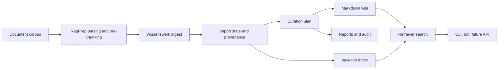

# Wissenswerk Architecture

Wissenswerk is a knowledge compiler, not only a chatbot. The product boundary is:

```text
RagPrep artifacts -> Wissenswerk import/curation -> Markdown wiki + provenance + retrieval + reports
```

## Layer Model

| Layer | Purpose | Surface |
|---|---|---|
| Contracts | Human- and agent-readable rules | `AGENTS.md`, `DESIGN.md`, `project_manifest.json` |
| Tenant config | Paths, providers, localization, memory, reset policy | `wissenswerk.yaml` |
| CLI | Portable execution surface | `./wissenswerk.py` |
| Corpus import | RagPrep chunk validation and state | `ingest --from-ragprep` |
| Curation | Article candidates, conflicts, next actions | `curate` |
| Wiki output | Markdown pages and reports | `wiki build` |
| Retrieval | Search over raw/wiki/all | `search` |
| Coordination | Local Signals and Tasks | `task`, `run status` |
| Quality | Contract, provider, design, export, and test checks | `doctor`, `design lint`, `export plan`, `test` |
| Reset | Local state reset and protected wipe planning | `reset`, `wipe` |

## Data Flow



## Provider Boundary

Wissenswerk configures chat, summary, embedding, and rerank profiles separately. Providers should be OpenAI-compatible endpoints and can run remotely or self-hosted.

The default vector target is PostgreSQL + pgvector.

## Platform Independence

IDE- or host-specific adapters are generated surfaces. Agent hosts should consume the same contracts:

- `AGENTS.md`
- `DESIGN.md`
- JSON CLI output
- tool manifests
- future MCP resources
- `project_manifest.json`

No host-specific file may become the only place where runtime semantics are defined.
