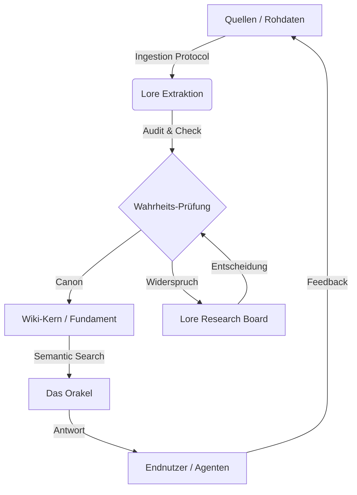

# Die Architektur der Verantwortung

> *"Ordnung ist nicht das Fehlen von Chaos, sondern die Präsenz von Struktur."*

Das Siebenwind Wiki ist mehr als eine Sammlung von Textdateien. Es ist ein **Kybernetisches System**, das menschliche Kreativität mit maschineller Präzision verbindet. Dieses Dokument beschreibt die Prinzipien, nach denen wir arbeiten.

## 1. Die Gewaltenteilung (Trias Politica)
Um Willkür und Halluzination zu vermeiden, trennt das System strikt zwischen drei Gewalten:

### 👑 Legislative (Der Nutzer / Der Kanon)
*Die gesetzgebende Gewalt.*
- **Funktion:** Definiert, was "Wahrheit" ist. Nur der Nutzer kann Kanon brechen oder neu definieren.
- **Instrumente:** `/decide` (Entscheidung), `/canon_update` (Gesetzesänderung).
- **Verantwortung:** Strategische Führung und kreative letzte Instanz.

### ⚖️ Judikative (Die Skripte)
*Die rechtsprechende Gewalt.*
- **Funktion:** Überwacht die Einhaltung der Regeln neutral und unbestechlich. Ein Skript "meint" nichts, es "prüft".
- **Instrumente:** `advisor.py` (Status-Prüfung), `register_check.py` (Gesetzes-Treue), `/audit` (Untersuchungsausschuss).
- **Verantwortung:** Konsistenz und technische Integrität. Meldet Verstöße, aber bestraft nicht selbstständig.

### ⚔️ Exekutive (Der Agent / KI)
*Die ausführende Gewalt.*
- **Funktion:** Setzt den Willen der Legislative unter Aufsicht der Judikative um.
- **Instrumente:** `/antigravity` (Dienst nach Vorschrift), `/repair` (Reparatur), `/wiki_process` (Verwaltung).
- **Verantwortung:** Operative Exzellenz. Der "Beamte", der den Vorgang akribisch bearbeitet.

---

## 2. Der Wisdom Loop (Weisheits-Kreislauf)

Der Prozess der Wissensgenerierung ist zyklisch, nicht linear.

1.  **Ingestion:** Rohdaten (Boten, Logs) werden strukturiert aufgenommen.
2.  **Extraktion:** Fakten werden isoliert und in Kontext gesetzt.
3.  **Wahrheits-Prüfung (Judikative):** Widerspricht das Neue dem Alten?
4.  **Integration:** Das Wissen wird Teil des Fundaments.
5.  **Abruf (Orakel):** Das Wissen steht sofort via Vektorsuche zur Verfügung.

---

## 3. Eskalationsstufen
Wir arbeiten nach dem Prinzip der minimal notwendigen Bürokratie.

- **Level 1: Standard-Exekution** (Routineaufgaben, klare Quellen).
- **Level 2: Kontrollierte Exekution** (Zusammenführung widersprüchlicher Quellen).
- **Level 3: Judizieller Prozess** (Unklarer Kanon, User-Intervention nötig -> Synapse Board).

---

## 4. Technische Prinzipien
- **Single Source of Truth:** Es gibt nur eine Wahrheit, und sie liegt im Markdown.
- **Link-Dichte:** Wir streben eine hohe Vernetzung (>50 Links / 1k Worte) an.
- **Atomare Commits:** Änderungen werden logisch getrennt.
