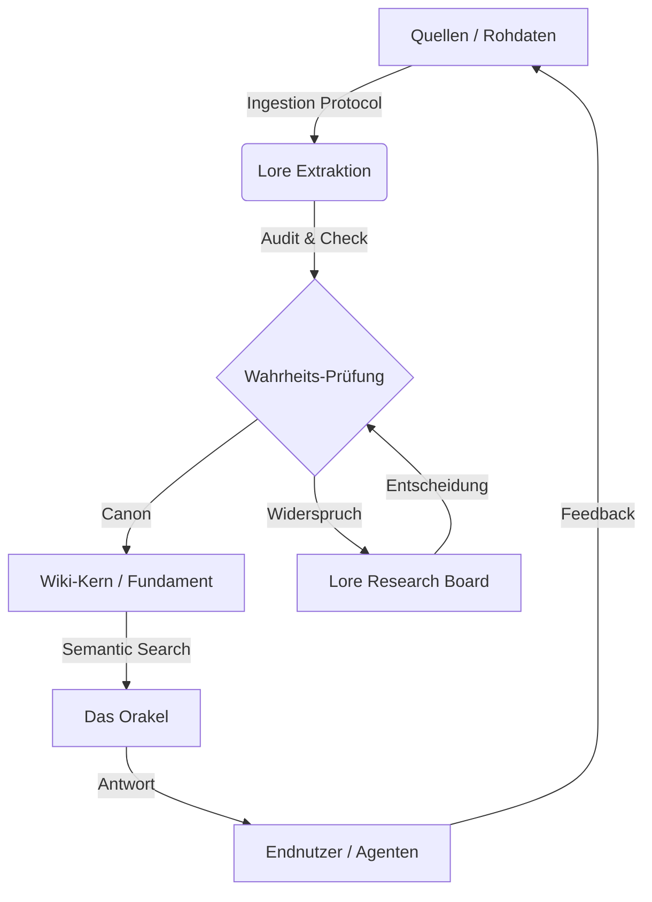

# System-Architektur und Prinzipien

Das Siebenwind Wiki ist ein strukturiertes Archivsystem zur Konsolidierung von Rollenspiel-Lore. Es kombiniert manuelle Dokumentation mit automatisierter Konsistenzprüfung.

## System-Komponenten (Trias Politica)

Das System ist in drei funktionale Bereiche unterteilt:

### Legislative (Nutzer/Kanon)
*Die definierende Instanz.*
- Legt den Kanon und die Regeln der Lore-Extraktion fest.
- Validiert widersprüchliche Quellen über das Synapse Board.

### Judikative (Prüfskripte)
*Die überwachende Instanz.*
- Skriptbasierte Prüfung von Registern und Links.
- Identifikation von Redundanzen und Fehlinterpretationen.

### Exekutive (KI-Agenten)
*Die ausführende Instanz.*
- Durchführung der Datenextraktion und Dokumentenpflege nach vorgegebenen Protokollen.

---

## 2. Der Wisdom Loop (Weisheits-Kreislauf)

Der Prozess der Wissensgenerierung ist zyklisch, nicht linear.

1.  **Ingestion:** Rohdaten (Boten, Logs) werden strukturiert aufgenommen.
2.  **Extraktion:** Fakten werden isoliert und in Kontext gesetzt.
3.  **Wahrheits-Prüfung (Judikative):** Widerspricht das Neue dem Alten?
4.  **Integration:** Das Wissen wird Teil des Fundaments.
5.  **Abruf (Orakel):** Das Wissen steht sofort via Vektorsuche zur Verfügung.

---

## 3. Eskalationsstufen
Wir arbeiten nach dem Prinzip der minimal notwendigen Bürokratie.

- **Level 1: Standard-Exekution** (Routineaufgaben, klare Quellen).
- **Level 2: Kontrollierte Exekution** (Zusammenführung widersprüchlicher Quellen).
- **Level 3: Judizieller Prozess** (Unklarer Kanon, User-Intervention nötig -> Synapse Board).

---

## 4. Technische Prinzipien
- **Single Source of Truth:** Es gibt nur eine Wahrheit, und sie liegt im Markdown.
- **Link-Dichte:** Wir streben eine hohe Vernetzung (>50 Links / 1k Worte) an.
- **Atomare Commits:** Änderungen werden logisch getrennt.
