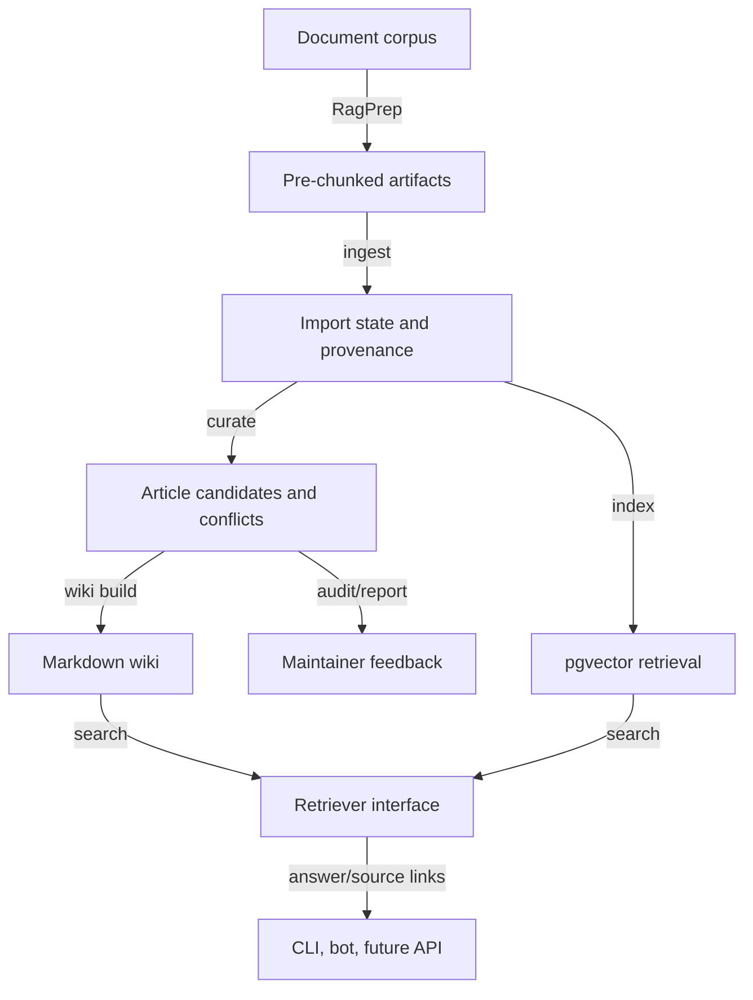

# System Architecture

Wissenswerk compiles prepared document corpora into an auditable Markdown wiki.

```text
RagPrep artifacts -> ingest -> curate -> wiki build -> search/bot/API
```

## Canonical Surfaces

- `./wissenswerk.py`
- `wissenswerk.yaml`
- `project_manifest.json`
- `wissenswerk_export_manifest.json`
- `AGENTS.md`
- `DESIGN.md`

The public core uses English IDs for roles, commands, schemas, and APIs. Labels and generated prose can be localized by tenant configuration.

## Knowledge Compiler Loop



## Responsibility Split

| Responsibility | Owner |
|---|---|
| Runtime CLI | `wissenswerk.py` |
| Tenant config | `wissenswerk.yaml` |
| Product manifest | `project_manifest.json` |
| Agent contract | `AGENTS.md` |
| Design contract | `DESIGN.md` |
| Retrieval target | PostgreSQL + pgvector |
| Corpus preparation | RagPrep |

## Platform Independence

Wissenswerk is specified through open repository contracts and machine-readable command output. IDE-specific files are adapters, not authorities.

Agents and tools should prefer:

- `AGENTS.md`
- `DESIGN.md`
- `./wissenswerk.py ... --json`
- `project_manifest.json`
- future MCP/tool manifests

## State and Persistence

Facts are derived from sources, wiki pages, provenance, and retrieval indexes. Session memory, chat logs, and optional memory providers can improve continuity, but they are not factual authority.

Runtime state, local DB files, private RagPrep outputs, bot sessions, and provider secrets are ignored by git.
