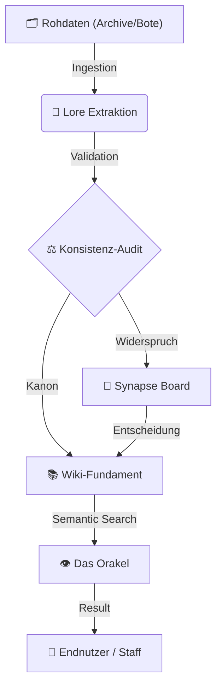

{ .wiki-banner }

---

<p class="sw-lede">
Ein rekonstruiertes Weltarchiv: klar strukturiert, quellenbasiert und auf Dauerbetrieb ausgelegt.
</p>

## Das Vermächtnis

Willkommen in der **Siebenwind Lore Engine**. Dies ist ein lebendes Denkmal für über **20 Jahre kollektive Kreativität**.

Seit zwei Jahrzehnten weben Hunderte von Köpfen an diesem Teppich aus Geschichten und Schicksalen. Unsere Mission ist es, dieses Erbe – diesen Schatz menschlicher Interaktion – mit moderner Intelligenz zu bewahren und für die Zukunft sicherzustellen.

---

## System-Architektur

Das Projekt basiert auf einem kybernetischen Kreislauf der Wissensgenerierung:



---

## Kernpfade

| Sektion | Zweck | Dokumentation |
| :--- | :--- | :--- |
| **Navigation** | Der Einstieg in die Welt. | [Wiki-Startpunkt](Siebenwind_Wiki/index.md) |
| **Setup** | Architektur des Orakels. | [Setup RAG](setup_rag.md) |
| **Philosophie** | Grundgesetze des Systems. | [Architektur](architecture.md) |
| **Fortschritt** | Rekonstruktions-Status. | [Master Task List](MASTER_TASK_LIST.md) |

---

## Unified CLI: `7w_wiki.py`

Die gesamte Intelligenz des Systems ist in einem Werkzeug gebündelt:

```bash
# Das Wissen des Orakels abfragen
./7w_wiki.py search "Wer war Benedict Rabenfels?"

# Den Konsistenz-Status prüfen
./7w_wiki.py audit

# Den Status des Archivars abrufen
./7w_wiki.py advisor
```

---

## Mitarbeit & Vermächtnis
Wir bewahren das Werk einer ganzen Gemeinschaft. Beteiligungen sind ausdrücklich erwünscht.
- **Detaillierte Richtlinien:** Siehe [CONTRIBUTING.md](CONTRIBUTING.md)
- **Lizenzen:** Code unter [MIT](LICENSE.md), Inhalte unter [CC BY-NC-SA 4.0](https://creativecommons.org/licenses/by-nc-sa/4.0/)

*© 2026 Siebenwind Gemeinschaft | Das Gedächtnis der Welt.*
