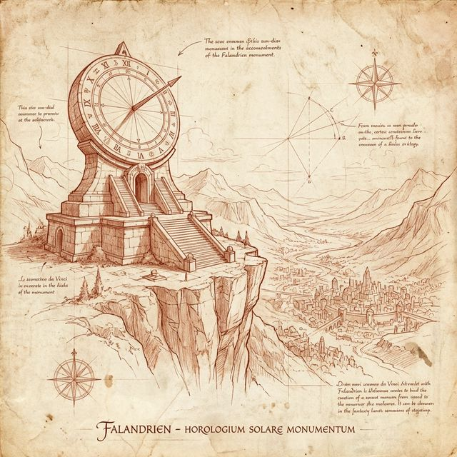
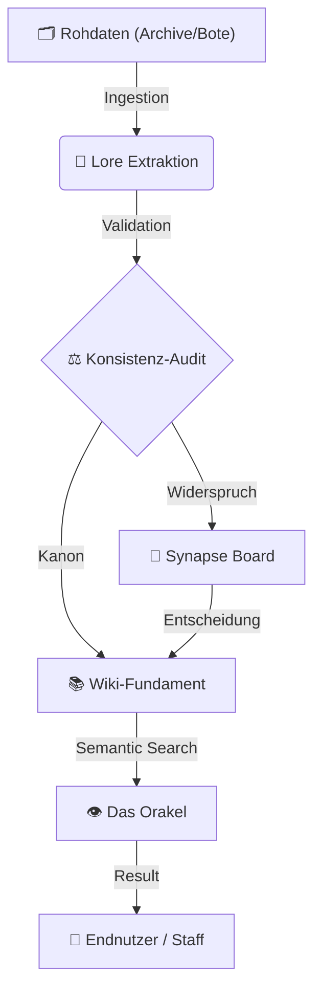

{ .wiki-banner }

<p align="center">
  <a href="https://github.com/Siebenwind/7w_wiki" target="_blank">
    
  </a>
  <a href="https://Siebenwind.github.io/7w_wiki/">
    
  </a>
  <a href="CHANGELOG.md">
    
  </a>
</p>

---

## 🏛️ Das Vermächtnis (The Core)

Willkommen in der **Siebenwind Lore Engine**. Dies ist ein lebendes Denkmal für über **20 Jahre kollektive Kreativität**. 

Seit zwei Jahrzehnten weben Hunderte von Köpfen an diesem Teppich aus Geschichten und Schicksalen. Unsere Mission ist es, dieses Erbe – diesen Schatz menschlicher Interaktion – mit moderner Intelligenz zu bewahren und für die Zukunft sicherzustellen.

---

## 🧠 System-Architektur (The Wisdom Loop)

Das Projekt basiert auf einem kybernetischen Kreislauf der Wissensgenerierung:



---

## 📜 Die Goldenen Protokolle

| Sektion | Zweck | Dokumentation |
| :--- | :--- | :--- |
| **🧭 Navigation** | Der Einstieg in die Welt. | [Wiki-Startpunkt](Siebenwind_Wiki/index.md) |
| **🛠️ Setup** | Architektur des Orakels. | [Setup RAG](setup_rag.md) |
| **📜 Philosophie** | Grundgesetze des Systems. | [Architektur](architecture.md) |
| **📈 Fortschritt** | Rekonstruktions-Status. | [Master Task List](MASTER_TASK_LIST.md) |

---

## 🚀 Unified CLI: `7w_wiki.py`

Die gesamte Intelligenz des Systems ist in einem Werkzeug gebündelt:

```bash
# Das Wissen des Orakels abfragen
./7w_wiki.py search "Wer war Benedict Rabenfels?"

# Den Konsistenz-Status prüfen
./7w_wiki.py audit

# Den Status des Archivars abrufen
./7w_wiki.py advisor
```

---

## 🤝 Mitarbeit & Lizenz
Wir bewahren das Werk von Vielen. Wenn du Fehler findest oder Lore ergänzen möchtest:
- **Code:** [MIT License](https://github.com/Siebenwind/7w_wiki/blob/main/LICENSE)
- **Content:** CC BY-NC-SA 4.0 (Community Legacy)

*© 2026 Siebenwind Archivare | Bewahrung durch Diskretion.*
